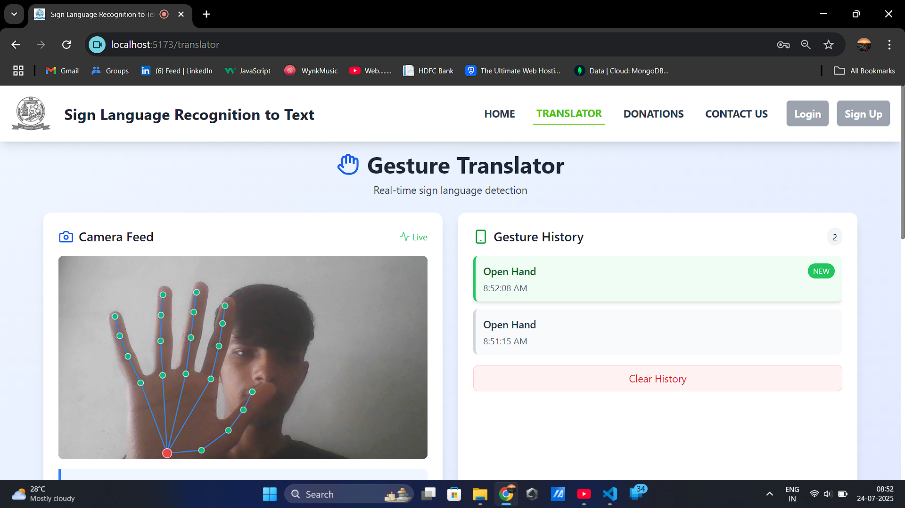
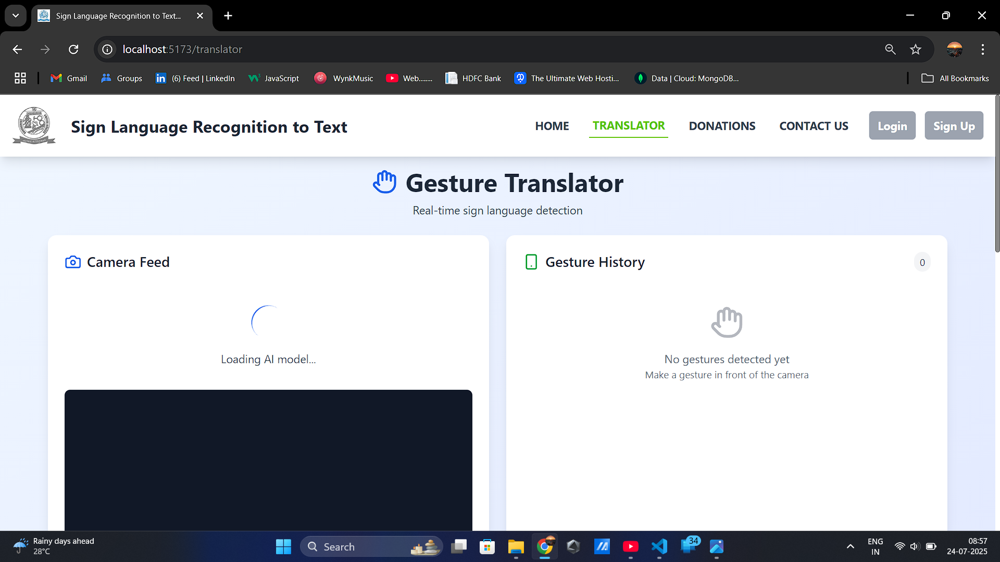

# 👐 Gesture Detection: Sign Language to Text 📖✨



## 🤖 What is This Project?

Gesture Detection translates sign language gestures into written text in real-time!  
Empowering accessibility and breaking communication barriers. 🌍

---

## 🌟 Features

- 🖐️ Detects hand gestures
- 📝 Converts gestures to text
- 💬 Real-time translation
- 🎨 Simple & beautiful UI
- ⚡ Fast and accurate

---

## 🚀 Getting Started


1. **Install dependencies**  
   ```bash
   npm install
   ```

2. **Start the app**  
   ```bash
   npm run dev
   ```

Open [localhost:5173](http://localhost:5173) in your browser to begin! 🎉

---

## 🖼️ Demo



---

## 🔍 How It Works

- 📷 Uses your webcam to capture hand gestures
- 🧠 AI model recognizes sign language
- 📝 Translates it into text on screen

### Main Components

- `GestureDetector` 🖐️ — Captures and processes video
- `TextOutput` 📝 — Displays translated text
- `UIControls` 🎛️ — Start/stop detection

---

## 🤝 Contributing

Got ideas or improvements?  
Open an issue or pull request! 🛠️

---

## 📬 Contact

Questions? Suggestions?  
Reach out on [GitHub Issues](https://github.com/harsh5979/gesture-detection/issues) or email hello@example.com.

---

## 📄 License

MIT © Harsh